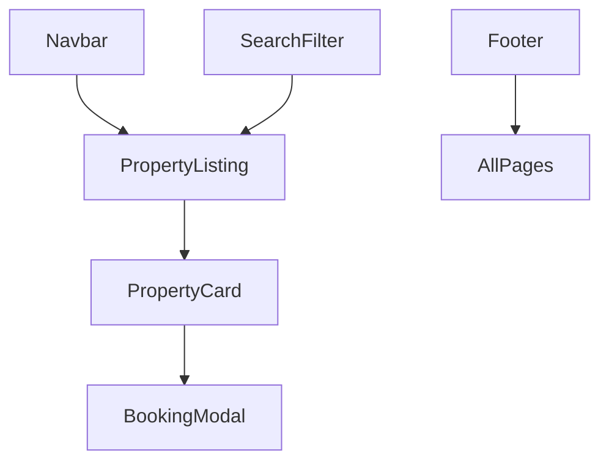
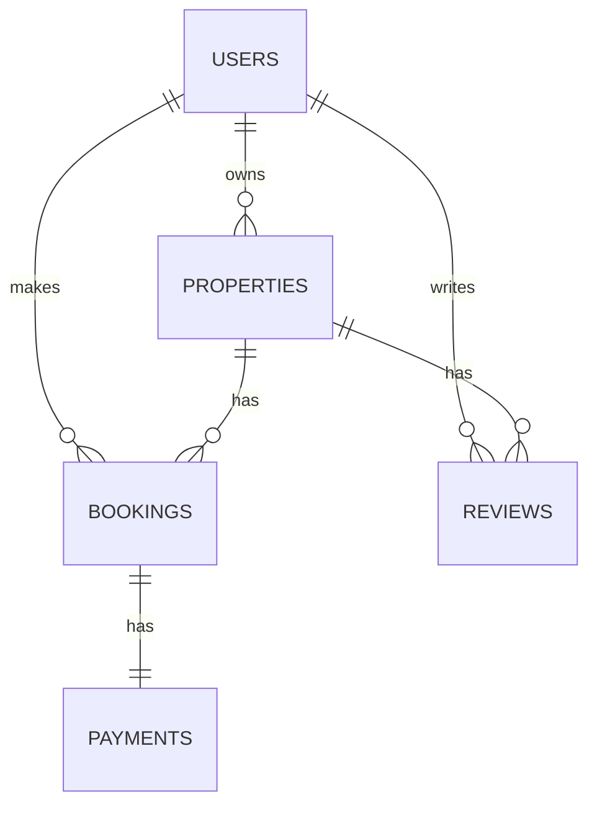

# airbnb-clone-project.

 
 

# FRONTEND
 

## UI/UX Design Planning
 ### DESIGN GOAL
A good booking system should have a simple but lovely UI/UX that allows users to perform basic functionalities.
 
 

## Pages	Description	UI
**Page-1** This is the main interface of the AirBnB clone. It shows a clean and modern layout with various property listings displayed, each with a title, price, and a brief description. The design focuses on user-friendly navigation and visual appeal.

**Page-2**	This page illustrates a detailed view of a specific property listing within the AirBnB clone. It highlights key features such as the property’s name, location, price, and additional details like amenities. The interface emphasizes clarity and ease of use for potential renters.

**Page-3**	This page showcases the booking or reservation process for the selected property in the AirBnB clone. It may include options for selecting dates, the number of guests, and finalizing the booking. The design is streamlined to ensure a smooth user experience.
 
 

### Key features to be implemented:
**Property Listings:** Display properties with relevant details and images. 
**Booking System:** Allow users to book properties, view booking details, and manage bookings. 
**Search Functionality:** Enable users to search for properties based on various criteria (location, price, availability). 
**User Authentication:** Secure login and registration for users.
 
 

### User-Friendly Design: Why It Matters  
#### **Purpose**  
Make software **intuitive, efficient, and accessible** for all users.  

#### **Benefits**  
- **Faster adoption** – Users learn quickly.  
- **Fewer errors** – Clear guidance = fewer mistakes.  
- **Higher retention** – Happy users stay.  
- **Lower support costs** – Less confusion = fewer tickets.  

#### **Key Principles**  
1. **Simplicity** – Avoid clutter.  
2. **Consistency** – Predictable patterns.  
3. **Feedback** – Confirm actions (e.g., success messages).  
4. **Accessibility** – Works for all abilities (WCAG compliance).  

#### **Example**  
- ❌ Bad: Hidden save button, no error hints.  
- ✅ Good: One-click save, real-time validation.
 
 

---

### Color Styles

| Color Name   | Hex Code |
|--------------|----------|
| Primary      | #34967C  |   
| Secondary    | #222222  |  
| Accent       | #FFA800  |  
| Shimmer      | #E9E9E9  |  

---
 

### Why Identify Mockup Design Properties?

#### **Core Benefits**
- **Consistency** - Maintains uniform UI/UX across all screens
- **Efficiency** - Speeds up development with clear specs
- **Collaboration** - Aligns designers, devs, and stakeholders
- **Scalability** - Enables easy future updates/theming

---

#### **Key Properties to Document**
| Category       | Examples                      |
|----------------|-------------------------------|
| **Layout**     | Grids, breakpoints, containers|
| **Typography** | Fonts, sizes, line heights    |
| **Colors**     | HEX values, usage rules       |
| **Spacing**    | Padding, margins, gutters     |
| **Components** | Buttons, inputs, states       |
| **Interactions**| Animations, transitions      |

---

 
 

### Typography System

#### Heading Text
- **Font**: Quicksand
- **Size**: 39px
- **Weight**: 700 (Bold)
- **Letter Spacing**: -0.32px
- **Use Case**: Main headings, hero text

#### Body Text
- **Font**: Quicksand
- **Size**: 18px
- **Weight**: 500 (Medium)
- **Letter Spacing**: -0.32px
- **Use Case**: Paragraphs, main content

#### Small Text
- **Font**: Quicksand
- **Size**: 10-14px (Responsive)
- **Weight**: 500 (Medium)
- **Letter Spacing**: -0.32px
- **Use Case**: Captions, labels, secondary info

 
 
 

## Project Roles and Responsibilities

### Project Manager (PM) 
**Overview**: The leader responsible for planning, executing, and closing projects.  
**Key Responsibilities**:
- Oversee project progress and ensure milestones are met
- Facilitate team communication
- Manage timelines, budget, and resources
- Identify and mitigate risks
- Primary stakeholder contact

### Frontend Developers 
**Overview**: Focus on client-side development for optimal user experience.  
**Key Responsibilities**:
- Implement UI/UX designs (HTML/CSS/JavaScript)
- Develop React components with API integration
- Ensure responsiveness across devices
- Collaborate with designers
- Optimize for speed and scalability

### Backend Developers 
**Overview**: Handle server-side logic and data management.  
**Key Responsibilities**:
- Develop server-side logic (Python/Node.js/Java)
- Design and manage databases
- Create/maintain APIs
- Implement security measures
- Optimize server performance

### Designers 
**Overview**: Create visually appealing and user-friendly interfaces.  
**Key Responsibilities**:
- Produce wireframes, mockups, and prototypes
- Design layouts and visual elements
- Maintain brand consistency
- Collaborate with frontend developers
- Conduct usability testing

### QA/Testers 
**Overview**: Ensure application quality and reliability.  
**Key Responsibilities**:
- Develop/execute test plans
- Perform manual/automated testing
- Identify/document/track bugs
- Verify fixes and regression testing
- Ensure quality standards

### DevOps Engineers 
**Overview**: Manage deployment and operational efficiency.  
**Key Responsibilities**:
- Automate deployment processes
- Manage cloud infrastructure
- Monitor performance/uptime
- Implement CI/CD pipelines
- Ensure production security

### Product Owner (PO) 
**Overview**: Define product vision and requirements.  
**Key Responsibilities**:
- Prioritize product features
- Manage product backlog
- Liaise between stakeholders and team
- Ensure business-value delivery
- Make scope decisions

### Scrum Master 
**Overview**: Facilitate Agile/Scrum processes.  
**Key Responsibilities**:
- Organize Scrum ceremonies
- Remove team impediments
- Foster collaboration
- Coach on Agile principles
- Drive continuous improvement

 
 
 

## UI Component Patterns

### Navbar Component
**Purpose**: Global navigation and user access  
**Features**:
- Logo/Branding (homepage link)
- Search Bar (location/date/guests filters)
- User Menu (login/signup → profile/dashboard)
- "List Your Property" CTA button
- Mobile-responsive hamburger menu

### Property Card Component
**Purpose**: Display rental property previews  
**Features**:
- Image carousel with hover zoom
- Property details (title, location, price/night)
- Rating system (0-5 stars)
- Amenities badges (max 3 icons)
- Wishlist toggle button
- "Superhost" verification badge

### Footer Component
**Purpose**: Site-wide information and links  
**Features**:
- Three-column layout (Discover, Hosting, Support)
- Social media links
- Newsletter signup form
- Copyright/legal info
- Mobile-optimized accordion

### Search Filter Component
**Purpose**: Refine property searches  
**Features**:
- Price range slider
- Amenities checklist
- Property type dropdown
- Instant results filtering
- Mobile drawer implementation

### Booking Modal
**Purpose**: Handle reservation flow  
**Features**:
- Interactive date picker
- Guest counter
- Price breakdown
- "Book Now" CTA
- Payment method integration

### Interactive Map
**Purpose**: Geographic property browsing  
**Features**:
- Google Maps API integration
- Cluster markers
- Property pins with price tags
- Viewport-aware loading
- Fullscreen toggle

---

### Component Relationships

---

 
 
 
 
 

# BACKEND
 

## Overview
The backend for the Airbnb Clone project is designed to provide a robust and scalable foundation for managing user interactions, property listings, bookings, and payments. This backend will support various functionalities required to mimic the core features of Airbnb, ensuring a smooth experience for users and hosts.

 
 

## Project Goals  
- **User Management**: Implement a secure system for user registration, authentication, and profile management.  
- **Property Management**: Develop features for property listing creation, updates, and retrieval.  
- **Booking System**: Create a booking mechanism for users to reserve properties and manage booking details.  
- **Payment Processing**: Integrate a payment system to handle transactions and record payment details.  
- **Review System**: Allow users to leave reviews and ratings for properties.  
- **Data Optimization**: Ensure efficient data retrieval and storage through database optimizations.

 
 

## Technology Stack

### Backend
- **Django**: High-level Python web framework for building the RESTful API.  
- **Django REST Framework**: Tools for creating/managing RESTful APIs.  
- **Celery**: Handles asynchronous tasks (notifications, payments).  

### Database & Query
- **PostgreSQL**: Powerful relational database for structured data storage.  
- **GraphQL**: Flexible querying for efficient data retrieval.  
- **Redis**: Caching and session management.  

### DevOps & Deployment
- **Docker**: Containerization for consistent environments.  
- **CI/CD Pipelines**: Automated testing and deployment.

 
 

---

## Team Roles
| Role                  | Responsibilities                                                                 |
|-----------------------|---------------------------------------------------------------------------------|
| Backend Developer     | Implements API endpoints, database schemas, and business logic.                |
| Database Administrator| Manages database design, indexing, and optimizations.                          |
| DevOps Engineer       | Handles deployment, monitoring, and scaling of backend services.               |
| QA Engineer           | Ensures backend functionalities are thoroughly tested and meet quality standards.|

---

 
 

## Database Design

### Key Entities

#### 1. Users
- **Fields**:  
  - `id` (Primary Key)  
  - `username`  
  - `email` (Unique)  
  - `password_hash`  
  - `role` (e.g., guest, host, admin)  
- **Relationships**:  
  - A user can **own multiple properties** (One-to-Many).  
  - A user can **make multiple bookings** (One-to-Many).  
  - A user can **write multiple reviews** (One-to-Many).  

#### 2. Properties
- **Fields**:  
  - `id` (Primary Key)  
  - `title`  
  - `description`  
  - `price_per_night`  
  - `owner_id` (Foreign Key → Users)  
- **Relationships**:  
  - A property **belongs to one user** (owner) (Many-to-One).  
  - A property can **have multiple bookings** (One-to-Many).  
  - A property can **have multiple reviews** (One-to-Many).  

#### 3. Bookings
- **Fields**:  
  - `id` (Primary Key)  
  - `check_in_date`  
  - `check_out_date`  
  - `total_price`  
  - `guest_id` (Foreign Key → Users)  
  - `property_id` (Foreign Key → Properties)  
- **Relationships**:  
  - A booking **belongs to one user** (guest) (Many-to-One).  
  - A booking **belongs to one property** (Many-to-One).  
  - A booking can **have one payment** (One-to-One).  

#### 4. Reviews
- **Fields**:  
  - `id` (Primary Key)  
  - `rating` (e.g., 1-5 stars)  
  - `comment`  
  - `user_id` (Foreign Key → Users)  
  - `property_id` (Foreign Key → Properties)  
- **Relationships**:  
  - A review **belongs to one user** (Many-to-One).  
  - A review **belongs to one property** (Many-to-One).  

#### 5. Payments
- **Fields**:  
  - `id` (Primary Key)  
  - `amount`  
  - `status` (e.g., pending, completed, failed)  
  - `booking_id` (Foreign Key → Bookings)  
  - `payment_method`  
- **Relationships**:  
  - A payment **belongs to one booking** (One-to-One).  

---

### Entity Relationship Diagram (Conceptual)

---

 
 

## Feature Breakdown
### User Authentication  
**Features**:  
- Register new users  
- Authenticate users  
- Manage user profiles  

### Property Management  
**Features**:  
- Create property listings  
- Update property listings  
- Retrieve property listings  
- Delete property listings  

### Booking System  
**Features**:  
- Make bookings  
- Update bookings  
- Manage bookings (including check-in/check-out details)  

### Payment Processing  
**Features**:  
- Handle payment transactions for bookings  

### Review System  
**Features**:  
- Post reviews for properties  
- Manage reviews

 
 

## API Security

### Key Security Measures

#### 1. Authentication
- **JWT (JSON Web Tokens)** for stateless user authentication.
- **OAuth 2.0** for third-party login (e.g., Google, Facebook).
- **Password hashing** (bcrypt/scrypt) with salt for stored credentials.

#### 2. Authorization
- **Role-Based Access Control (RBAC)** to restrict actions (e.g., only hosts can edit properties).
- **Resource ownership checks** (e.g., users can only delete their own reviews).

#### 3. Rate Limiting
- **Throttling** (e.g., 100 requests/minute per IP) to prevent brute force/DDoS attacks.
- **API key rotation** for third-party integrations.

#### 4. Data Protection
- **HTTPS/TLS** encryption for all communications.
- **Sensitive data masking** (e.g., partial credit card display).

#### 5. Payment Security
- **PCI-DSS compliance** via Stripe/PayPal integration (no raw payment data storage).
- **Double verification** for booking transactions.

---

### Why Security Matters

| Area               | Risks Mitigated                          | Security Importance                                                                 |
|--------------------|------------------------------------------|------------------------------------------------------------------------------------|
| **User Data**      | Identity theft, spam                     | Protects personal info (emails, passwords) and prevents account takeovers.         |
| **Payments**       | Fraud, chargebacks                       | Ensures financial transactions are irreversible and tamper-proof.                   |
| **Properties**     | Unauthorized edits, fake listings        | Maintains platform integrity and host trust.                                        |
| **Reviews**        | Fake reviews, spam                       | Preserves review authenticity and user confidence.                                  |
| **API Infrastructure** | DDoS, resource exhaustion           | Guarantees service availability and performance under load.                         |

---

 
 

## CI/CD Pipeline

### What is CI/CD?
**CI/CD** (Continuous Integration and Continuous Deployment) is a development practice that automates the process of integrating code changes, testing, and deploying applications.  
- **Continuous Integration (CI)**: Automatically builds and tests every code change pushed to the repository.  
- **Continuous Deployment (CD)**: Automatically deploys validated changes to production/staging environments.  

### Why It Matters for This Project
1. **Faster Releases**: Automates repetitive tasks, reducing manual errors and speeding up delivery.  
2. **Early Bug Detection**: Catches issues in development/testing stages before they reach production.  
3. **Consistency**: Ensures every change is tested and deployed in a standardized way.  
4. **Scalability**: Simplifies managing deployments as the project grows.  

### Tools & Workflow
#### Core Tools:
- **GitHub Actions** (CI/CD automation)  
- **Docker** (Containerization for consistent environments)  
- **PostgreSQL** (Database testing)  
- **Pytest** (Python test automation)  

#### Pipeline Stages:
1. **Code Push**: Triggers the pipeline on `git push` to `main` or feature branches.  
2. **Build**: Creates Docker images for the application.  
3. **Test**: Runs unit/integration tests with Pytest.  
4. **Deploy**:  
   - **Staging**: Auto-deploys to a test environment on successful builds.  
   - **Production**: Manual approval for production deployments.
  
> "Documentation is a love letter that you write to your future self." - Damian Conway

